# 计算机图形学——作业一

姓名：胡舸耀

学号：22336084

## 一、作业要求

1. 环境搭建
2. 绘制平面姓名首字母
3. 绘制立体姓氏首字母

## 二、作业环境

1. Visual Studio 2022；
2. Qt 5.13.0

## 三、作业过程以及结果

### 3.1 环境配置

已安装Visual Studio 2022 community版本，只需要重启解决方案即可正常运行。

接下来安装Qt，进行Qt 5.13.0 安装。点开环境配置中URL，显示404 NOT FOUND。

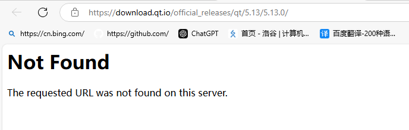

退回到前一URL页面：

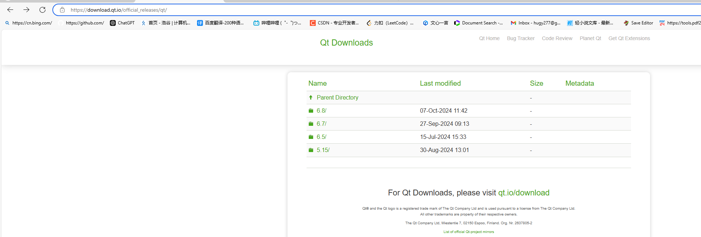

发现没有5.13.0版本选择下载，查阅后发现archive版本中有5.13.0版本，故在其中下载

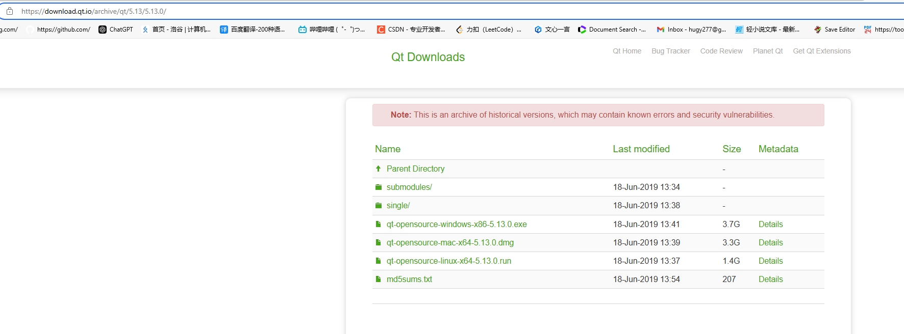

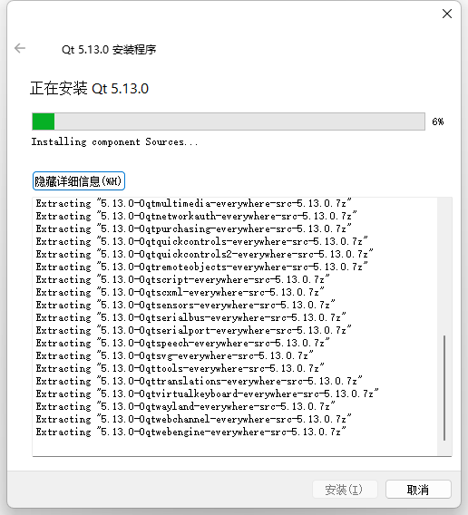

安装好后进行Qt VS Tools 扩展安装，打开visualstudio，菜单栏点击“扩展->管理扩展”，在浏览中输入框搜索 Qt，安装 Qt Visual Studio Tools，安装完成后关闭 VS 以应用 Qt 扩展

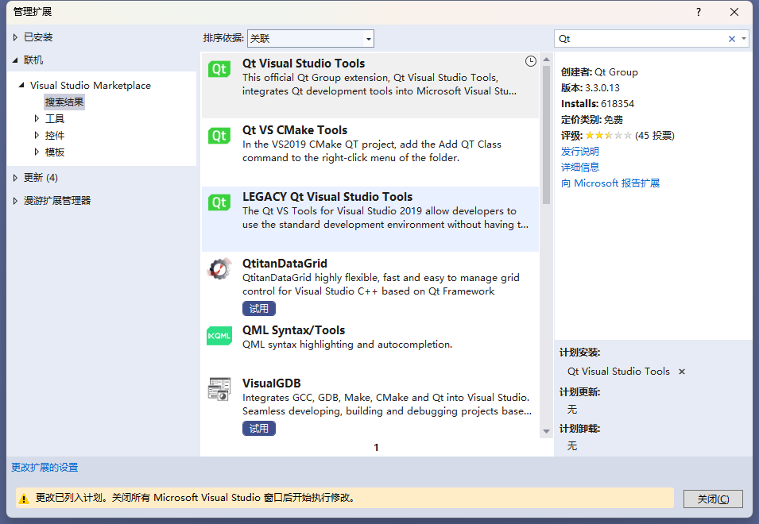

在选项找到Qt，点开version，点击 Add，浏览到 Qt 编辑器的安装路径，添加version如下，并设置默认编辑器

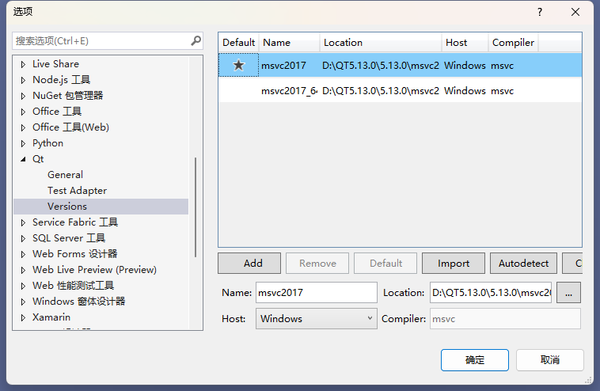

接下来在电脑环境变量中加入Qt和cl.exe，键入 `qmake -tp vc`可以得到输出文件

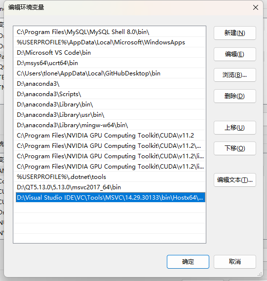

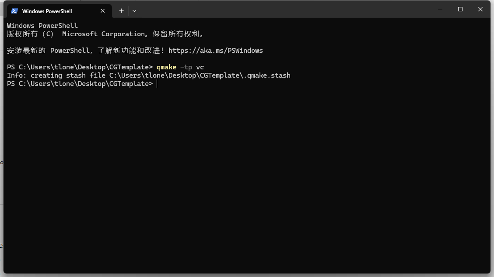

打开文件，运行main.cpp，报错，无法访问GL/glew.h

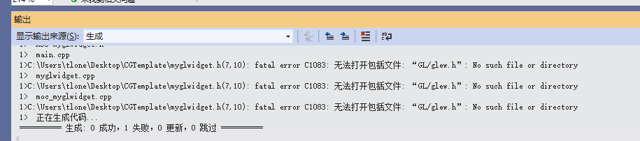

下载GLEW（Binaries Windows 32-bit and 64 bit）后，打开相应的.pro 文件，加入以下代码

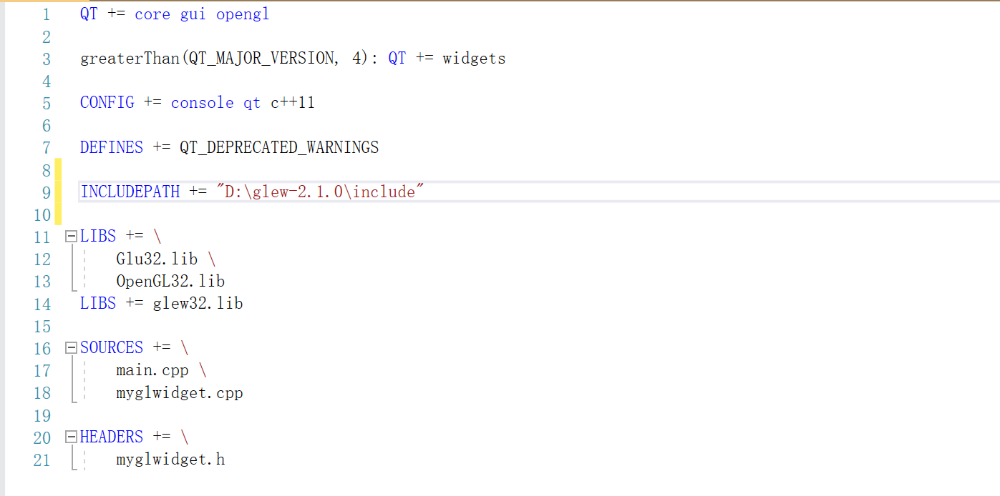

重新生成qmake文件后，运行main.cpp文件，出现找不到glew32.lib情况，只需要在项目属性中，打开链接器，在输入中将glew32.lib改为绝对路径，我这里是D:\glew-2.1.0\lib\Release\x64\glew32.lib。或者将该文件复制放到项目解决方案同一子目录下也可以解决。

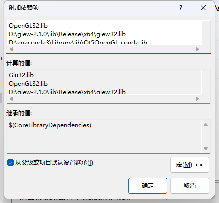

接下来运行main.cpp，可以得到正确输出，环境配置到此结束

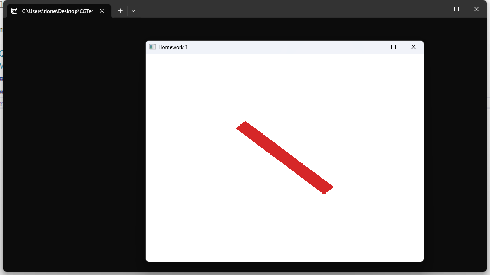

### 3.2 绘制平面姓名首字母

我名字的首字母分别为H、G、Y，其中H最为简单，从H开始，在这里我选择用两竖一横来绘画H，共六个三角形，，其他字母同理，用三角形构造。我这里选择分别用 `drawH(); drawG();  drawY();`来代表绘画三个字母的函数，并在头文件中添加函数声明，具体函数实现如下：

```cpp
// 绘制字母 H
void MyGLWidget::drawH()
{
    glColor4f(1.0f, 0.0f, 0.0f, 0.9f); // 红色，透明度0.9
    // 左竖线
    glBegin(GL_TRIANGLES);
    glVertex2f(-50.0f, -200.0f);
    glVertex2f(-50.0f, 200.0f);
    glVertex2f(0.0f, -200.0f);

    glVertex2f(-50.0f, 200.0f);
    glVertex2f(0.0f, 200.0f);
    glVertex2f(0.0f, -200.0f);
    glEnd();
    // 横杠
    glBegin(GL_TRIANGLES);
    glVertex2f(0.0f, -25.0f);
    glVertex2f(0.0f, 25.0f);
    glVertex2f(100.0f, -25.0f);

    glVertex2f(100.0f, 25.0f);
    glVertex2f(100.0f, -25.0f);
    glVertex2f(0.0f, 25.0f);
    glEnd();
    //右竖线
    glBegin(GL_TRIANGLES);
    glVertex2f(100.0f, -200.0f);
    glVertex2f(100.0f, 200.0f);
    glVertex2f(150.0f, -200.0f);

    glVertex2f(100.0f, 200.0f);
    glVertex2f(150.0f, 200.0f);
    glVertex2f(150.0f, -200.0f);
    glEnd();
}
```

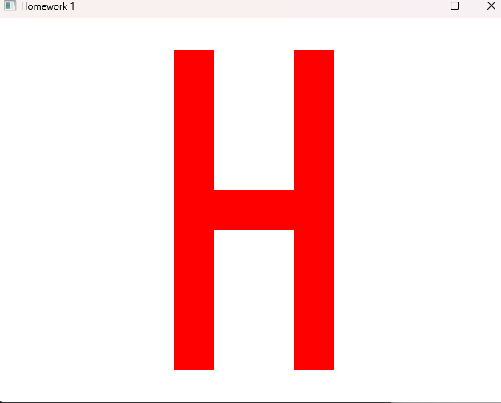

设计G字母，左半圆用五条线段组成，即一个八边形去掉右弧三条边，再加上一个小T字母在尾部：

```cpp
// 绘制字母 G
void MyGLWidget::drawG()
{
    glColor4f(0.0f, 1.0f, 0.0f, 0.6f); // 绿色，0.6透明度
    //中间横
    glBegin(GL_QUAD_STRIP);
    glVertex2f(-50.0f, 0.0f);
    glVertex2f(-70.0f, 0.0f);
    glVertex2f(-50.0f, 100.0f);
    glVertex2f(-70.0f, 100.0f);
    glEnd();
    //左下斜边
    glBegin(GL_TRIANGLES);
    glVertex2f(-50.0f, 0.0f);
    glVertex2f(-70.0f, 0.0f);
    glVertex2f(0.0f, -50.0f);

    glVertex2f(0.0f, -50.0f);
    glVertex2f(0.0f, -70.0f);
    glVertex2f(-70.0f, -0.0f);
    glEnd();
    //左上斜边
    glBegin(GL_TRIANGLES);
    glVertex2f(0.0f, 150.0f);
    glVertex2f(0.0f, 170.0f);
    glVertex2f(-50.0f, 100.0f);

    glVertex2f(-70.0f, 100.0f);
    glVertex2f(-50.0f, 100.0f);
    glVertex2f(0.0f, 170.0f);
    glEnd();
    //下横
    glBegin(GL_QUAD_STRIP);
    glVertex2f(0.0f, -50.0f);
    glVertex2f(0.0f, -70.0f);
    glVertex2f(100.0f, -50.0f);
    glVertex2f(100.0f, -70.0f);
    glEnd();
    //上横
    glBegin(GL_QUAD_STRIP);
    glVertex2f(0.0f, 150.0f);
    glVertex2f(0.0f, 170.0f);
    glVertex2f(100.0f, 150.0f);
    glVertex2f(100.0f, 170.0f);
    glEnd();
    //T竖
    glBegin(GL_QUAD_STRIP);
    glVertex2f(100.0f, -50.0f);
    glVertex2f(100.0f, -10.0f);
    glVertex2f(80.0f, -50.0f);
    glVertex2f(80.0f, -10.0f);
    glEnd();
    //T横
    glBegin(GL_QUAD_STRIP);
    glVertex2f(60.0f, -10.0f);
    glVertex2f(60.0f, 10.0f);
    glVertex2f(120.0f, -10.0f);
    glVertex2f(120.0f, 10.0f);
    glEnd();
}
```

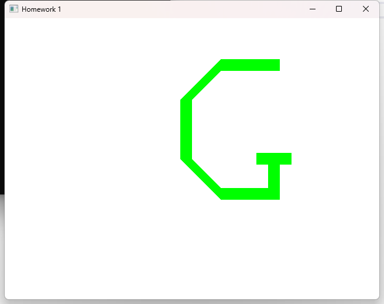

设计Y字母，用三个矩形表示三条线，中间用三角形填充

```cpp
// 绘制字母 Y
void MyGLWidget::drawY()
{
    glColor4f(0.0f, 0.0f, 1.0f, 0.3f); // 蓝色
    // 下半
    glBegin(GL_QUAD_STRIP);
    glVertex2f(10.0f, -100.0f);
    glVertex2f(10.0f, 50.0f);
    glVertex2f(-10.0f, -100.0f);
    glVertex2f(-10.0f, 50.0f);
    glEnd();
    //右上
    glBegin(GL_QUAD_STRIP);
    glVertex2f(10.0f, 50.0f);
    glVertex2f(0.0f, 65.0f);
    glVertex2f(60.0f, 136.5f);
    glVertex2f(42.7f, 146.5f);
    glEnd();
    //左上
    glBegin(GL_QUAD_STRIP);
    glVertex2f(-10.0f, 50.0f);
    glVertex2f(0.0f, 65.0f);
    glVertex2f(-60.0f, 136.5f);
    glVertex2f(-42.7f, 146.5f);
    glEnd();
    // 三角形
    glBegin(GL_TRIANGLES);
    glVertex2f(0.0f, 65.0f);
    glVertex2f(-10.0f, 50.0f);
    glVertex2f(10.0f, 50.0f);
    glEnd();
}
```

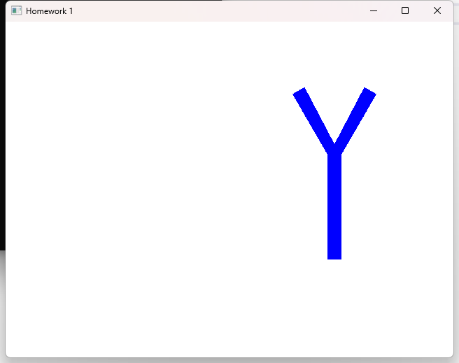

调整位置与粗细后，完整名字首字母如下：

```cpp
void MyGLWidget::scene_1()
{
    glClear(GL_COLOR_BUFFER_BIT);
    glMatrixMode(GL_PROJECTION);
    glLoadIdentity();
    glOrtho(0.0f, width(), 0.0f, height(), -1000.0f, 1000.0f);

    glMatrixMode(GL_MODELVIEW);
    glLoadIdentity();
    glTranslatef(0.5 * width(), 0.5 * height(), 0.0f);  // 移动到窗口中心

    // 绘制字母 H
    glPushMatrix();
    glTranslatef(-200.0f, 0.0f, 0.0f);  // 移动到合适位置
    drawH();
    glPopMatrix();

    // 绘制字母 G
    glPushMatrix();
    glTranslatef(0.0f, -50.0f, 0.0f);  // 适当平移以防重叠
    drawG();
    glPopMatrix();

    // 绘制字母 Y
    glPushMatrix();
    glTranslatef(200.0f, -50.0f, 0.0f);  // 适当平移以防重叠
    drawY();
    glPopMatrix();
}
```

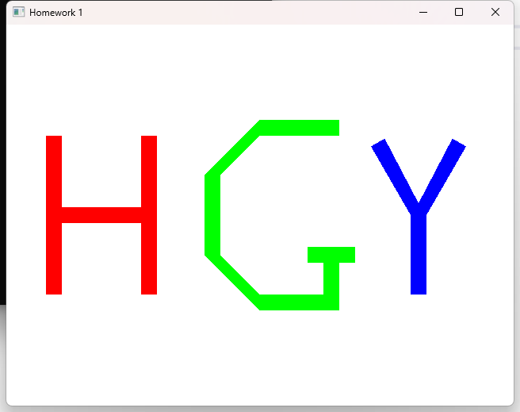

#### 讨论

##### 1.比较 GL_TRIANGLES, GL_TRIANGLE_STRIP, GL_QUAD_STRIP 的绘制开销（需要的glVertex 调用次数）

在 `GL_TRIANGLES` 中，每个三角形都需要三个顶点。也就是说，若你想绘制 `N` 个三角形，你需要 `3 * N` 个 `glVertex` 调用；

`GL_TRIANGLE_STRIP` 使用一个三角形带，其中每新增一个顶点，都能与前两个顶点共同构成一个新的三角形。第一个三角形使用前 3 个顶点，后续每增加一个顶点就会形成一个新的三角形。因此，绘制 `N` 个三角形，只需要 `N + 2` 个顶点；

`GL_QUAD_STRIP` 是四边形带，每新增一个顶点，便与前两个顶点和上一个四边形的两个顶点共同构成一个新的四边形。第一个四边形需要 4 个顶点，后续每新增一个顶点，就会生成一个新的四边形。因此，绘制 `N` 个四边形，所需的顶点数是 `N + 2`；

当 `GL_TRIANGLES` 绘制四边形时，就相当于两个三角形合并起来，想绘制 `N` 个四边形需要 `6 * N` 个 `glVertex` 调用；

##### 2.比较以下两个视角下，`Orthogonal` 及 `Perspective` 投影方式产生的图像：

###### 1) 从 `(0, 0, d)` 看向原点 `(0, 0, 0)` 的图像

* **正交投影** :所有物体会以相同的大小呈现，不论它们距离摄像机多远或多近。即使物体距离观察者更远，投影仍然是相同的大小。由于视角是正对原点的，所有物体的比例和相对位置保持不变。没有透视效果。
* **透视投影** :物体的大小会随着它们距离观察者的远近而变化。离观察者更远的物体会显得更小。由于透视效果，物体在画面上的位置会发生压缩，且画面中心（原点）周围的物体显得较大，而画面边缘的物体显得较小，特别是那些位于较远位置的物体。

###### 2) 从 `(0, 0.5 * d, d)` 看向原点 `(0, 0, 0)` 的图像

* **正交投影** :在正交投影下，改变观察者的位置不会影响物体的投影大小或比例。即使观察者偏离了原点，所有物体依然以相同的比例显示。由于观察者位置的变化，物体的相对排列和方向可能会发生变化，但物体的形状和大小保持不变。
* **透视投影** :在透视投影下，观察者偏移会引入一个明显的透视效果。由于视角的位置变化，物体的大小和位置会发生变化。特别是远离观察者的物体会显得更小，并且由于位置的偏移，物体的形状可能会有一些变形，尤其是原点附近的物体。由于观察者在 `y` 轴上的偏移，透视效果会导致物体沿 `y` 轴方向有不同的压缩度，物体在垂直方向上的大小和形状可能发生变化。

### 3.3 绘制立体姓氏首字母

为实现第二个任务，添加场景2，在按压键盘2键时进入

```cpp
void MyGLWidget::scene_2()
{
    glClear(GL_COLOR_BUFFER_BIT);
    glMatrixMode(GL_PROJECTION);
    glLoadIdentity();
    glOrtho(0.0f, width(), 0.0f, height(), -1000.0f, 1000.0f);

    glMatrixMode(GL_MODELVIEW);
    glLoadIdentity();
    glTranslatef(0.5 * width(), 0.5 * height(), 0.0f);  // 移动到窗口中心
}
```

要实现立体字母，利用 `drawH()`函数，在Z轴上加厚

```cpp
void MyGLWidget::draw3DH(float thickness)
{
    // 绘制字母 H 的 3D 版本
    glPushMatrix();
    glTranslatef(0.0f, 0.0f, -thickness / 2.0f);
    for (int i = -thickness; i < thickness; i += 1.0f) {
        glTranslatef(0.0f, 0.0f, 0.5f);
        drawH();
    }
    glPopMatrix();

  
}
```

为实现旋转，我们利用 `glRotatef()`函数，实现在x，y，z三轴上的旋转

```cpp
void MyGLWidget::scene_2()
{
    glClear(GL_COLOR_BUFFER_BIT);
    glMatrixMode(GL_PROJECTION);
    glLoadIdentity();
    glOrtho(0.0f, width(), 0.0f, height(), -1000.0f, 1000.0f);

    glMatrixMode(GL_MODELVIEW);
    glLoadIdentity();
    glTranslatef(0.5 * width(), 0.5 * height(), 0.0f);  // 移动到窗口中心

    // 设置字母 H 的厚度
    float thickness = 20.0f;

    //// 绘制字母 H（绕 X 轴旋转）
    glPushMatrix();
    glRotatef(rotationX, 1.0f, 0.0f, 0.0f);  // 绕 X 轴旋转
    glTranslatef(0.0f, 0.0f, 0.0f);  // 平移到合适位置
    draw3DH(thickness);
    glPopMatrix();
  
    // 绘制字母 H（绕 Y 轴旋转）
    //glPushMatrix();
    //glRotatef(rotationY, 0.0f, 1.0f, 0.0f);  // 绕 Y 轴旋转
    //glTranslatef(0.0f, 0.0f, 0.0f); 
    //draw3DH(thickness);
    //glPopMatrix();

    // 绘制字母 H（绕 Z 轴旋转）
    //glPushMatrix();
    //glRotatef(rotationZ, 0.0f, 0.0f, 1.0f);  // 绕 Z 轴旋转
    //glTranslatef(0.0f, 0.0f, 0.0f); 
    //draw3DH(thickness);
    //glPopMatrix();
}
```

使用时，选择你要旋转的轴，并将其他轴代码注释（也可以调整字母位置，绘制三个立体H，同时显示），按压x，y，z即可分别实现x，y，z轴上的旋转。

如果想要实现顺时针或者逆时针旋转，只需要将 `keyPressEvent(QKeyEvent *e)`函数中，按压对应轴键增加的角度变为减少，因为这部分实验结果是动态的，所以具体实验结果请查看演示视频。

```cpp

void MyGLWidget::keyPressEvent(QKeyEvent *e) {
	//Press 0 or 1 to switch the scene
	if (e->key() == Qt::Key_0) {
		scene_id = 0;
		update();
	}
	else if (e->key() == Qt::Key_1) {
		scene_id = 1;
		update();
	}
    else if(e->key() == Qt::Key_2){
        scene_id = 2;
        update();
    }
    else if (e->key() == Qt::Key_X) {
        rotationX += 5.0f;  // 每次按键增加旋转角度
        //rotationX -= 5.0f;  //即可实现旋转方向相反
        update();
    }
    else if (e->key() == Qt::Key_Y) {
        rotationY += 5.0f;  // 每次按键增加旋转角度
        update();
    }
    else if (e->key() == Qt::Key_Z) {
        rotationZ += 5.0f;  // 每次按键增加旋转角度
        update();
    }
}
```

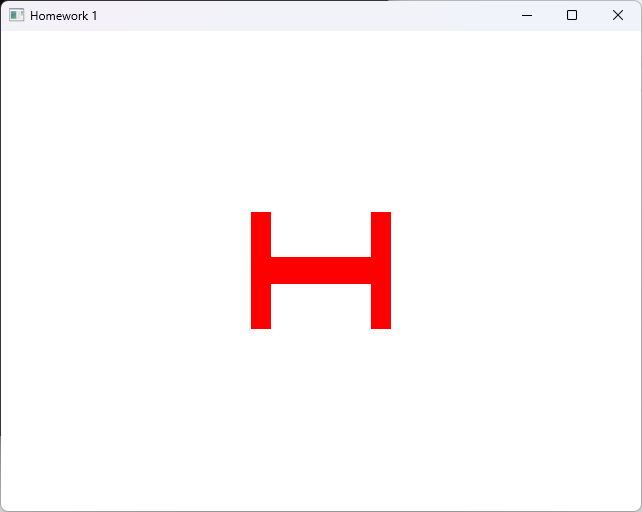

## 四、作业总结

在实验中，我们实现了openGL的环境配置、绘制平面姓名字母、立体字母绘制和旋转。初次接触OpenGL，环境配置是一个比较大的困难，visualStudio版本选择，Qt工具的下载过程中就经常存在版本不符合，无法找到对应版本的问题，例如vs2019在官网中已经无法下载，需要我们找到私人公开库才能找到对应安装包。Qt工具的使用让我们更好的去利用OpenGL这个工具，第一次利用他画出我我们需要的图形是一个创新且具有挑战的过程，初次使用时还不熟悉函数的使用，有更好的解决办法并没有发现，希望在之后的学习过程中进一步去探究图形学的魅力。
