# 计算机图形学——作业二

姓名：胡舸耀

学号：22336084

## 一、作业要求

### 1、实现三角形的光栅化算法

实验要求：

1.1：用 DDA 实现三角形边的绘制

1.2：用 bresenham 实现三角形边的绘制

1.3：用 edge-walking 填充三角形内部颜色

讨论要求：

1.4：针对不同面数的模型，从实际运行时间角度讨论 DDA、bresenham 的绘制效率。

### 2、实现光照、着色

实验要求：

2.1：用 Gouraud 实现三角形内部的着色

2.2：用 Phong 模型实现三角形内部的着色

2.3：用 Blinn-Phong 实现三角形内部的着色

讨论要求：

2.4：结合实际运行时间讨论三种不同着色方法的效果、着色效率。

### 3、最终效果：

3.1 ：在 scene_0 中，加载单一三角形情况下，展 示 DDA-EdgeWalking 与Bresenham-EdgeWalking 两种方法下，三角形光栅化是否正确。

3.2：在 scene_1 中，加载复杂立体图形，用 Bresenham-EdgeWalking 方法，展示三种模型，在同一角度的光照效果（角度要能体现环境光、散射光、高光等）。

## 二、作业环境

1. Visual Studio 2022；
2. Qt 5.13.0

## 三、作业过程与结果

0、环境配置

pro 文件中，includepath 更改自己的 glew 文件位置；

cmd 中打开 Template 文件夹，输入命令 qmake -tp vc。然后双击打开 vcxproj 文件；

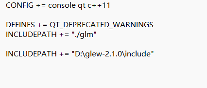

### 1、三角形光栅化：

#### 1.1：用 DDA 实现三角形边的绘制

添加DDA成员函数，由于 `x` 和 `y` 是浮动变量，直接将它们转换为整数索引时，可能会发生一些精度问题。为了确保精度，应该将 `x` 和 `y` 向下取整，并确保在屏幕范围内（即防止超出窗口的边界），超出边界外我们选择跳过渲染。

```cpp
void MyGLWidget::DDA(FragmentAttr& start, FragmentAttr& end, int id) {
	int x1 = start.x;
	int y1 = start.y;
	int x2 = end.x;
	int y2 = end.y;

	int dx = x2 - x1;
	int dy = y2 - y1;
	int steps = std::max(abs(dx), abs(dy));  // 计算步数
	float xIncrement = dx / float(steps);    // 每步增量
	float yIncrement = dy / float(steps);    // 每步增量

	float x = float(x1);
	float y = float(y1);

	for (int i = 0; i <= steps; i++) {
		// 如果像素在画布内，填充颜色
		int px = static_cast<int>(x);
		int py = static_cast<int>(y);

		// 防止超出画布的边界
		if (px >= 0 && px < WindowSizeW && py >= 0 && py < WindowSizeH) {
			// 在这里可以插值颜色、光照等信息
			temp_render_buffer[py * WindowSizeW + px] = PhoneShading(start);
			//temp_render_buffer[py * WindowSizeW + px] = vec3(0.0f, 1.0f, 0.0f);
			// 更新 temp_z_buffer
			temp_z_buffer[py * WindowSizeW + px] = (start.z + end.z) / 2.0f;
		}

		// 递增坐标
		x += xIncrement;
		y += yIncrement;
	}
}
```

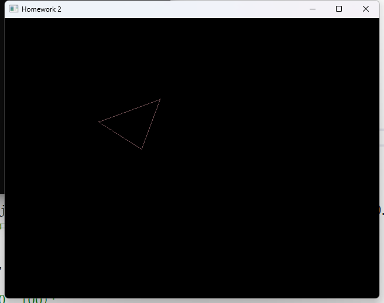

#### 1.2：用 bresenham 实现三角形边的绘制

补充bresenham，同样加入确保在屏幕范围内（即防止超出窗口的边界），超出边界外我们选择跳过渲染。得到结果相同。

```cpp
void MyGLWidget::bresenham(FragmentAttr& start, FragmentAttr& end, int id) {
	// 根据起点、终点，计算当前边在画布上的像素
	int x1 = start.x, y1 = start.y;
	int x2 = end.x, y2 = end.y;
	int dx = abs(x2 - x1);
	int dy = abs(y2 - y1);
	int sx = (x1 < x2) ? 1 : -1;
	int sy = (y1 < y2) ? 1 : -1;
	int err = dx - dy;

	// 确保边界检查，防止访问越界
	auto setColor = [this](int x, int y, const vec3& color) {
		if (x >= 0 && x < WindowSizeW && y >= 0 && y < WindowSizeH) {
			temp_render_buffer[y * WindowSizeW + x] = color;
		}
		};

	// 使用Bresenham算法遍历两点之间的所有像素
	while (true) {
		// 使用start和end之间的插值来计算颜色
		float alpha = float(x1 - start.x) / float(x2 - start.x + 1);
		float beta = 1.0f - alpha;
		FragmentAttr pixel;
		pixel.pos_mv = alpha * start.pos_mv + beta * end.pos_mv;
		pixel.normal = alpha * start.normal + beta * end.normal;

		// 调用PhoneShading计算最终颜色
		vec3 color = PhoneShading(pixel);
		// vec3 color = vec3(0.0f, 1.0f, 0.0f);

		// 将颜色设置到渲染缓冲区
		setColor(x1, y1, color);

		// 检查是否已到达终点
		if (x1 == x2 && y1 == y2) break;

		int e2 = err * 2;
		if (e2 > -dy) {
			err -= dy;
			x1 += sx;
		}
		if (e2 < dx) {
			err += dx;
			y1 += sy;
		}
	}
}
```

#### 1.3：用 edge-walking 填充三角形内部颜色

计算出计算y行与三角形每条边的交点（通过线段与扫描线的交点），在xstart到xend之间进行颜色填充，这里可以调用 `PhoneShading()`或设定颜色。

```cpp
int MyGLWidget::edge_walking(FragmentAttr transformedVertices[3]) {
	int firstChangeLine = WindowSizeH;

	// 遍历屏幕上的每一行（y轴）
	for (int y = 0; y < WindowSizeH; y++) {
		int xStart = WindowSizeW, xEnd = -1;

		// 计算y行与三角形每条边的交点（通过线段与扫描线的交点）
		for (int i = 0; i < 3; ++i) {
			int next = (i + 1) % 3;  // 下一个顶点的索引
			FragmentAttr v1 = transformedVertices[i];
			FragmentAttr v2 = transformedVertices[next];

			// 检查是否有交点（y值在这两点之间）
			if ((v1.y <= y && v2.y > y) || (v1.y > y && v2.y <= y)) {
				// 计算交点的x坐标
				float t = float(y - v1.y) / float(v2.y - v1.y);
				int xIntersection = int(v1.x + t * (v2.x - v1.x));

				// 更新扫描线的xStart和xEnd
				if (v1.y <= v2.y) {
					xStart = std::min(xStart, xIntersection);
				}
				else {
					xEnd = std::max(xEnd, xIntersection);
				}
			}
		}

		// 如果有效的x范围，开始填充像素
		if (xStart <= xEnd) {
			for (int x = xStart; x <=xEnd; x++) {
				FragmentAttr pixel;

				// 计算插值系数
				float alpha = float(x - xStart) / float(xEnd - xStart);
				float beta = 1.0f - alpha;
				float gamma = 1.0f - alpha - beta;

				// 使用Barycentric插值计算位置、法线和深度值
				pixel.pos_mv = alpha * transformedVertices[0].pos_mv +
					beta * transformedVertices[1].pos_mv +
					gamma * transformedVertices[2].pos_mv;

				pixel.normal = alpha * transformedVertices[0].normal +
					beta * transformedVertices[1].normal +
					gamma * transformedVertices[2].normal;

				// 插值深度
				pixel.pos_mv.z = alpha * transformedVertices[0].pos_mv.z +
					beta * transformedVertices[1].pos_mv.z +
					gamma * transformedVertices[2].pos_mv.z;

				// 着色：计算光照
				// vec3 color = PhoneShading(pixel);  // 计算当前像素的最终颜色
				vec3 color = vec(1.0f, 0.0f, 0.0f);
				// 深度测试：如果当前像素的深度小于已存储深度，则更新颜色和深度缓冲
				int index = y * WindowSizeW + x;
				if (pixel.pos_mv.z < temp_z_buffer[index]) {
					temp_render_buffer[index] = color;
					temp_z_buffer[index] = pixel.pos_mv.z;
				}
			}

			// 更新 firstChangeLine 为第一个有效的行
			firstChangeLine = std::min(firstChangeLine, y);
		}
	}

	return firstChangeLine;
}
```

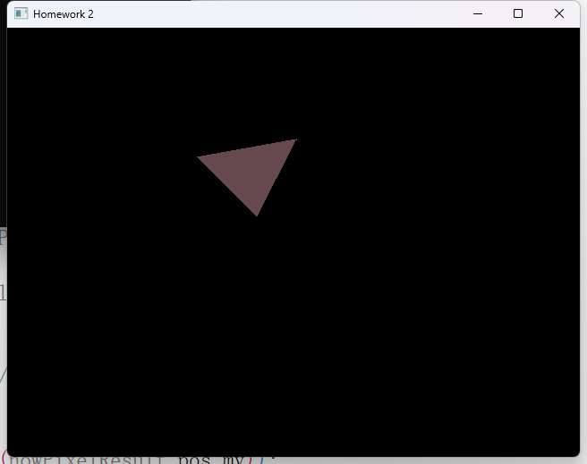

#### 1.4：针对不同面数的模型，从实际运行时间角度讨论 DDA、bresenham 的绘制效率。

我们分别运行场景一中 `objModel.loadModel("./objs/teapot_8000.obj")`两者分别需要时间。绘制7657个三角形，DDA需要18.10s，bresenham需要16.08s。

DDA 的时间复杂度为  **O(n)** ，其中 n 是线段的长度（像素点数）。每次迭代中，需要进行浮点运算，导致性能较差。适用于对精度要求较高的场合，但由于涉及浮点数计算，在大多数现代硬件上效率较低。

Bresenham 算法的时间复杂度同样是  **O(n)** ，但是每次迭代的操作次数非常少，只包括整数加法和比较操作，因此在实际运行时，它的性能要优于 DDA。特别是在要求高效渲染的环境中。它依赖整数计算，能够充分利用硬件资源，适用于大多数实际应用场景。

### 2.**实现光照、着色**

#### 2.1：用 Gouraud 实现三角形内部的着色

首先，我在这里选择添加多点光源，将 `lightPosition`设为数组，加入 `lightcolor`数组。

修改场景一如下：

```cpp
void MyGLWidget::scene_1()
{
	// 选择要加载的model
	//objModel.loadModel("./objs/teapot_600.obj");
	//objModel.loadModel("./objs/teapot_8000.obj");
	objModel.loadModel("./objs/rock.obj");
	//objModel.loadModel("./objs/cube.obj");
	//objModel.loadModel("./objs/singleTriangle.obj");

	// 自主设置变换矩阵
	camPosition = vec3(100 * sin(degree * 3.14 / 180.0) + objModel.centralPoint.y, 100 * cos(degree * 3.14 / 180.0) + objModel.centralPoint.x, 10+ objModel.centralPoint.z);
	camLookAt = objModel.centralPoint;     // 例如，看向物体中心
	camUp = vec3(0, 1, 0);         // 上方向向量
	projMatrix = glm::perspective(radians(20.0f), 1.0f, 0.1f, 2000.0f);
	// 单一点光源，可以改为数组实现多光源
	// lightPosition[0] = objModel.centralPoint + vec3(0, 100, 100);
	// 设置两个光源
	lightStrength = 1000.0f;
	lightPosition[0] = objModel.centralPoint + vec3(100, 100, -100);  // 第一个光源位置
	lightColor[0] = vec3(0.0f, 0.0f, 1.0f) * lightStrength;  // 光源1

	lightPosition[1] = objModel.centralPoint + vec3(-100, 100, -100);  // 第二个光源位置
	lightColor[1] = vec3(0.0f, 1.0f, 1.0f) * lightStrength;  // 光源2
	clearBuffer(render_buffer);
	clearZBuffer(z_buffer);
	for (int i = 0; i < objModel.triangleCount; i++) {
		Triangle nowTriangle = objModel.getTriangleByID(i);
		drawTriangle(nowTriangle);
	}
	glClear(GL_COLOR_BUFFER_BIT);
	renderWithTexture(render_buffer, WindowSizeH, WindowSizeW);
}
```

Gouraud 着色是一种基于顶点着色的插值算法，它通过计算每个顶点的颜色，然后在三角形的内部插值这些顶点颜色来实现最终的像素着色。具体来说，Gouraud 着色的步骤包括：

1. 计算每个顶点的颜色（通常使用光照模型如 Phong 或 Blinn-Phong 来计算顶点的颜色）。
2. 使用线性插值计算三角形内部每个像素的颜色。

```cpp
vec3 MyGLWidget::GouraudShading(FragmentAttr& vertex) {
	// 环境光强度
	float ambient = 5.0f;

	// 初始化最终颜色为环境光
	vec3 finalColor = vec3(0.0f);

	// 遍历每个光源，计算每个光源对顶点的贡献
	for (int i = 0; i < 2; ++i) {  // 有两个光源
		// 获取光源到当前顶点的方向
		vec3 lightDir = glm::normalize(lightPosition[i] - vec3(vertex.pos_mv));

		// 计算法向量与光源方向的点积，模拟漫反射光照
		float diff = std::max(glm::dot(vertex.normal, lightDir), 0.0f);

		// 高光反射
		vec3 viewDir = glm::normalize(camPosition - vec3(vertex.pos_mv));
		vec3 halfDir = glm::normalize(lightDir + viewDir);
		float spec = glm::pow(glm::max(glm::dot(vertex.normal, halfDir), 0.0f), 16);

		// 计算当前光源的光照贡献
		vec3 lightContrib = lightColor[i] * (diff + spec);  // 光源颜色和光照贡献加权

		// 将当前光源的贡献累加到最终颜色
		finalColor += lightContrib;
	}

	// 环境光的影响
	finalColor += ambient * vec3(0.1f, 0.1f, 0.1f);  // 假设一个小的环境光强度

	return finalColor;
}
int MyGLWidget::edge_walking(FragmentAttr transformedVertices[3]) { //选择Gouraud时，在场景一中要把光照强度设为1.0f(没有增加距离衰减)
	int firstChangeLine = WindowSizeH;

	// 计算每个顶点的颜色，考虑多个光源的影响
	vec3 colors[3];
	for (int i = 0; i < 3; ++i) {
		colors[i] = GouraudShading(transformedVertices[i]);  // 每个顶点的颜色计算
	}

	// 遍历屏幕上的每一行（y轴）
	for (int y = 0; y < WindowSizeH; y++) {
		int xStart = WindowSizeW, xEnd = -1;

		// 计算y行与三角形每条边的交点（通过线段与扫描线的交点）
		for (int i = 0; i < 3; ++i) {
			int next = (i + 1) % 3;  // 下一个顶点的索引
			FragmentAttr v1 = transformedVertices[i];
			FragmentAttr v2 = transformedVertices[next];

			// 检查是否有交点（y值在这两点之间）
			if ((v1.y <= y && v2.y > y) || (v1.y > y && v2.y <= y)) {
				// 计算交点的x坐标
				float t = float(y - v1.y) / float(v2.y - v1.y);
				int xIntersection = int(v1.x + t * (v2.x - v1.x));

				// 更新扫描线的xStart和xEnd
				if (v1.y <= v2.y) {
					xStart = std::min(xStart, xIntersection);
				}
				else {
					xEnd = std::max(xEnd, xIntersection);
				}
			}
		}

		// 如果有效的x范围，开始填充像素
		if (xStart <= xEnd) {
			for (int x = xStart; x <= xEnd; x++) {
				FragmentAttr pixel;

				// 计算插值系数
				float alpha = float(x - xStart) / float(xEnd - xStart);
				float beta = 1.0f - alpha;
				float gamma = 1.0f - alpha - beta;

				// 使用Barycentric插值计算颜色
				vec3 color = alpha * colors[0] + beta * colors[1] + gamma * colors[2];

				// 计算光照并更新颜色
				temp_render_buffer[y * WindowSizeW + x] = color;

				// 插值深度
				pixel.pos_mv.z = alpha * transformedVertices[0].pos_mv.z +
					beta * transformedVertices[1].pos_mv.z +
					gamma * transformedVertices[2].pos_mv.z;

				// 更新深度缓冲
				int index = y * WindowSizeW + x;
				if (pixel.pos_mv.z < temp_z_buffer[index]) {
					temp_z_buffer[index] = pixel.pos_mv.z;
				}
			}

			// 更新 firstChangeLine 为第一个有效的行
			firstChangeLine = std::min(firstChangeLine, y);
		}
	}

	return firstChangeLine;
}
```

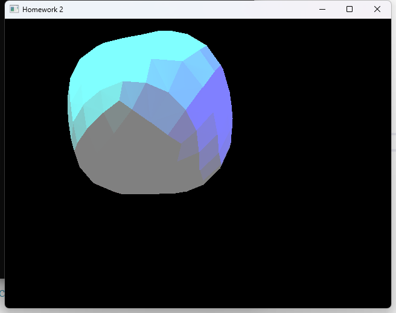

#### 2.2：用 Phong 模型实现三角形内部的着色

Phong 模型的光照计算可以通过以下公式实现：

$I = I_{\text{ambient}} + I_{\text{diffuse}} + I_{\text{specular}}$

其中：

* $I_{\text{ambient}}$为环境光的影响，通常为常量值；
* $I_{\text{diffuse}}$ 为漫反射光；
* $I_{\text{specular}}$ 为镜面反射光，：

**计算每个顶点的颜色** ：对于每个顶点，计算光照贡献，包括环境光、漫反射光和镜面反射光。

**插值顶点法线** ：通过 Barycentric 插值计算三角形内部每个像素的法线。

**计算像素的光照** ：使用 Phong 模型计算每个像素的最终颜色。

**增加光源衰减：**乘以一个应距离增加而减小的小于一的分数，体现光照强度减弱

```cpp
vec3 MyGLWidget::PhoneShading(FragmentAttr& nowPixelResult) {
	// 环境光强度
	float ambient = 0.1f;

	// 初始化最终颜色为环境光
	vec3 finalColor = vec3(0.1f, 0.0713f, 0.0757f) * 4.0f;  // 淡粉色
	//vec3 finalColor = vec3(ambient, ambient, ambient);

	// 遍历每个光源
	for (int i = 0; i < 2; ++i) {  //有两个光源
		// 获取光源到当前像素的方向
		vec3 lightDir = glm::normalize(lightPosition[i] - vec3(nowPixelResult.pos_mv));  // 将pos_mv转换为vec3

		// 计算法向量与光源方向的点积，模拟漫反射光照
		float diff = std::max(glm::dot(nowPixelResult.normal, lightDir), 0.0f);

		// 高光反射
		vec3 viewDir = glm::normalize(camPosition - vec3(nowPixelResult.pos_mv));
		vec3 halfDir = glm::normalize(lightDir + viewDir);
		float spec = glm::pow(glm::max(glm::dot(nowPixelResult.normal, halfDir), 0.0f), 16);

		// 计算当前光源的光照贡献
		vec3 lightContrib = lightColor[i] * (diff + spec);  // 光源颜色和光照贡献加权

		// 计算光源衰减
		float distance = glm::length(lightPosition[i] - vec3(nowPixelResult.pos_mv));
		float attenuation = 1.0f / (1.0f + 0.1f * distance * distance);  // 衰减公式
		lightContrib *= attenuation;

		// 将当前光源的贡献累加到最终颜色
		finalColor += lightContrib;
	}

	return finalColor;  // 返回最终计算的颜色
}
```

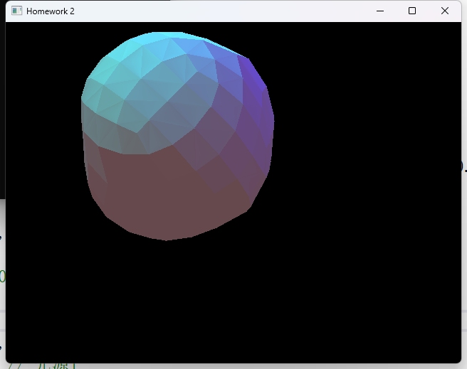

#### 2.3：用 Blinn-Phong 实现三角形内部的着色

**Blinn-Phong** 光照模型是对传统 Phong 光照模型的改进，主要改进点在于镜面反射部分的计算。传统的 Phong 模型使用了 视线向量 (View direction)和 光源方向 (Light direction) 之间的夹角来计算高光反射。而 Blinn-Phong 改用 半向量 (Half vector)来代替视线向量，从而提高了计算效率，并且减少了对镜面高光的计算敏感度。

```cpp
vec3 MyGLWidget::BlinnPhongShading(FragmentAttr& nowPixelResult) {
	// 环境光强度
	float ambient = 0.1f;

	// 初始化最终颜色为环境光
	vec3 finalColor = vec3(0.1f, 0.0713f, 0.0757f) * 4.0f;  // 淡粉色
	//vec3 finalColor = vec3(ambient, ambient, ambient);

	// 遍历每个光源
	for (int i = 0; i < 2; ++i) {  // 有2个光源
		// 获取光源到当前像素的方向
		vec3 lightDir = glm::normalize(lightPosition[i] - vec3(nowPixelResult.pos_mv));

		// 计算法向量与光源方向的点积，模拟漫反射光照
		float diff = glm::max(glm::dot(nowPixelResult.normal, lightDir), 0.0f);
		vec3 diffuse = diff * lightColor[i];

		// 计算视角方向
		vec3 viewDir = glm::normalize(camPosition - vec3(nowPixelResult.pos_mv));

		// 计算半程向量 H
		vec3 halfwayDir = glm::normalize(lightDir + viewDir);

		// 镜面反射光照（Blinn-Phong 模型）
		float spec = glm::pow(glm::max(glm::dot(nowPixelResult.normal, halfwayDir), 0.0f), 16);  // n=16，控制高光反射的锐度
		vec3 specular = spec * lightColor[i];

		// 计算光源衰减
		float distance = glm::length(lightPosition[i] - vec3(nowPixelResult.pos_mv));
		float attenuation = 1.0f / (1.0f + 0.1f * distance + 0.01f * distance * distance);  // 可以根据需要调整衰减公式

		// 计算光源的贡献
		vec3 lightContrib = (diffuse + specular) * attenuation;

		// 将当前光源的贡献累加到最终颜色
		finalColor += lightContrib;
	}

	return finalColor;  // 返回最终计算的颜色
}
```

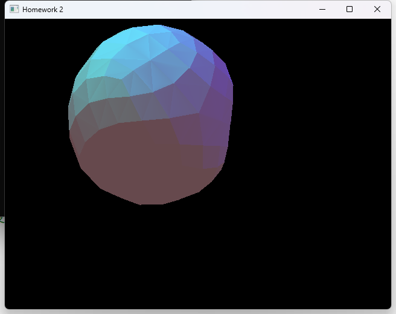

#### 2.4：结合实际运行时间讨论三种不同着色方法的效果、着色效率

三者运行场景一中 `objModel.loadModel("./objs/teapot_8000.obj")`两者分别需要时间。绘制7657个三角形，分别用时10.6s，18.8s，17.5s.

**Gouraud**着色是一种基于顶点着色的平滑着色方法。它的基本思路是在每个顶点上计算光照（包括环境光、漫反射和镜面反射），然后通过插值来确定三角形内部的颜色。

* 计算效率高 ：由于光照计算只在顶点上进行，内部的像素颜色通过插值计算得到，因此渲染时的计算量较小。实时渲染 ：适用于需要高效渲染的场景，尤其是在硬件渲染限制下。
* 不精确的光照效果 ：光照效果的计算依赖于顶点的插值，这意味着在复杂几何体（尤其是具有剧烈法线变化的表面）上，光照可能表现得不太精确，出现光斑或不自然的过渡。无法模拟细节 ：因为每个像素的光照是通过顶点的插值来获得的，所以光照细节和高光反射会受到较大限制，不能像Phong或Blinn-Phong那样在像素级别提供精细的控制。

**时间复杂度** ：`O(N)`，其中 `N` 是顶点数，光照计算只发生在每个顶点上。对于实时渲染（如游戏中的简单场景或低复杂度模型）来说，Gouraud着色提供了较好的性能。

**Phong**着色是一种基于每个像素进行光照计算的方法。它在每个像素上根据当前的法线、光源方向、视角方向计算光照，包括环境光、漫反射和镜面反射。

* 更精确的光照效果 ：因为每个像素的光照都是根据该像素的法线和光源方向计算的，所以可以产生比Gouraud更精确的效果，特别是在高光反射区域。**能够更好地表现细节 ：**适用于需要高质量光照效果的场景。
* 计算开销较大 ：每个像素都需要进行光照计算，尤其是高光反射和漫反射的计算，这在像素级别的计算中增加了计算量。**渲染效率较低 ：**由于每个像素都要计算光照，因此在高分辨率和复杂场景中，计算开销会显著增加。

**时间复杂度** ：`O(W * H)`，其中 `W` 和 `H` 分别为渲染区域的宽度和高度。每个像素的光照计算需要访问法线和光源方向等信息。适用于需要较高渲染质量、能够接受较高计算负担的场景，比如影视制作、特效渲染等。

**Blinn-Phong**着色是Phong着色的一种优化，主要通过使用半程向量（Halfway vector）代替反射向量来计算高光反射。它的光照计算方式比Phong着色更高效，尤其是在复杂场景中。

* 计算更高效 ：由于使用了半程向量代替反射向量，Blinn-Phong的计算效率更高，特别是在复杂的场景中。提供高质量的高光反射 ：尽管计算效率较高，但它仍能提供类似于Phong模型的高质量光照效果，特别是在高光反射表现上有更好的平滑度。
* 与Phong模型的效果差异 ：在某些场景下，Blinn-Phong可能比Phong模型略逊色，尤其是在非常平滑或特殊的反射表面上（例如镜面反射非常强的场景）。

**时间复杂度** ：`O(W * H)`，与Phong着色相同。每个像素都需要进行漫反射和高光反射的计算，但由于使用半程向量，计算上通常比Phong更高效。适用于需要较高质量光照效果的实时渲染场景（如游戏引擎中的动态光照处理）。

到这里我们就实现了需要实现的全部功能。

### 3.最终效果：

#### 3.1 ： 在 scene_0 中 ， 加 载 单 一 三 角 形 情 况 下 ， 展 示 DDA-EdgeWalking 与 Bresenham-EdgeWalking 两种方法下，三角形光栅化是否正确。

这里我均选择调用Phong着色，设置边缘为绿色，DDA 和 Bresenham花边分别如下：

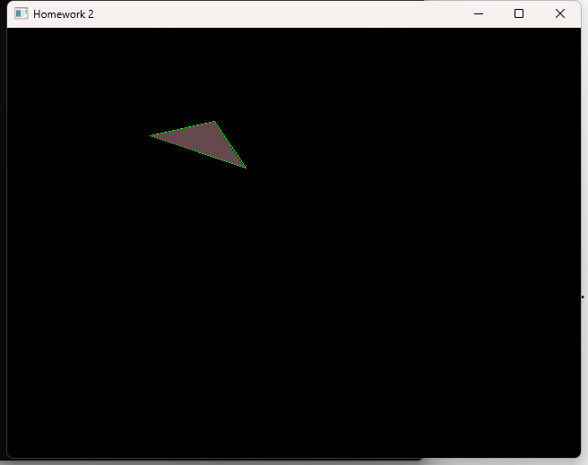

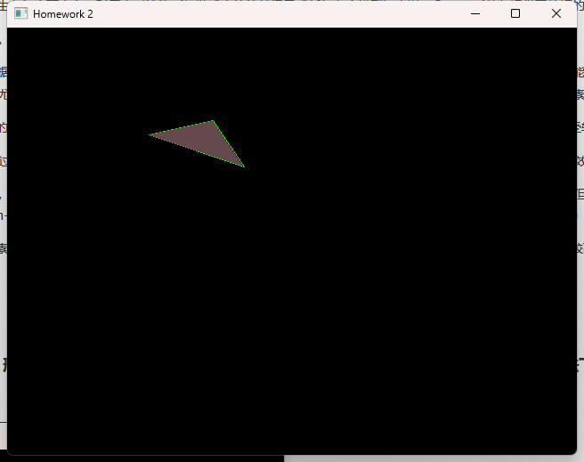

#### 3.2：在 scene_1 中，加载复杂立体图形，用 Bresenham-EdgeWalking 方法，展示三种模型，在同一角度的光照效果（角度要能体现环境光、散射光、高光等）。

环境光设为淡粉色，两个光源分别为蓝色和紫色，边设为黑色（即不添加颜色），用 Blinn-Phong 实现三角形内部的着色：

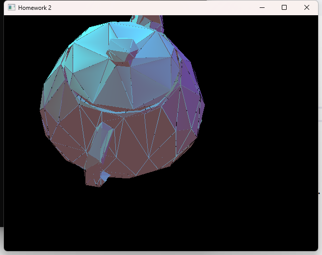

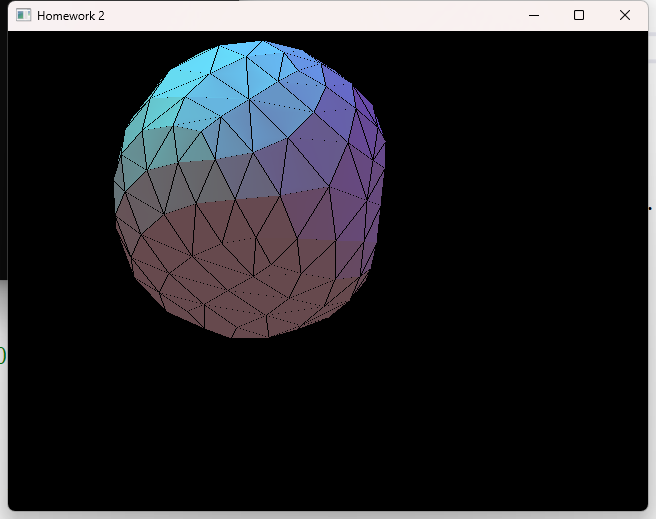


同时设置边渲染，让物体边缘不影响：

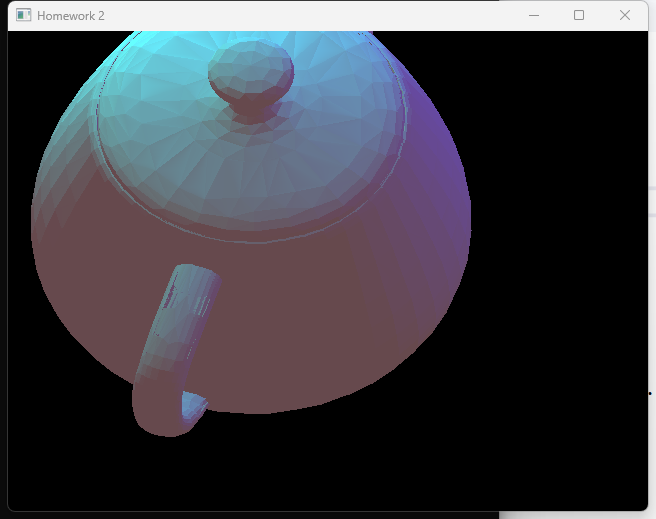

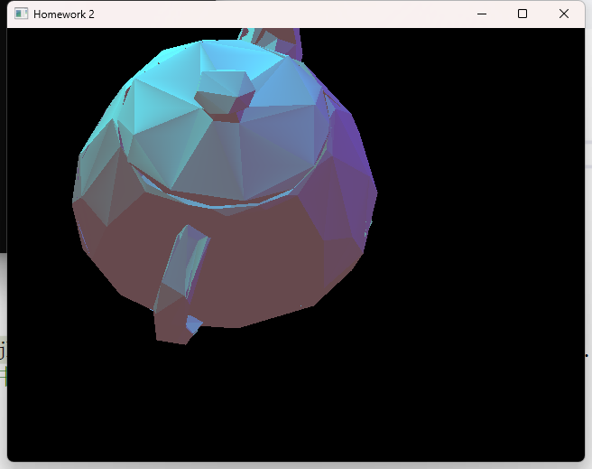

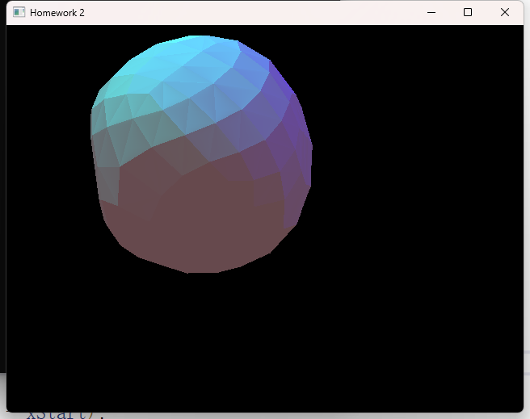

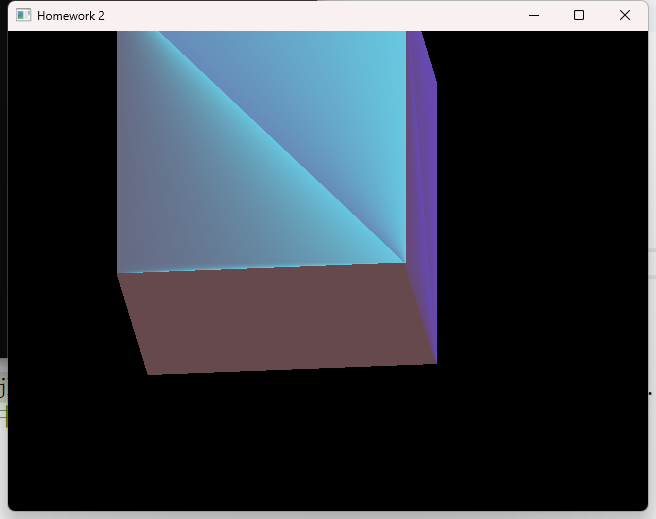
