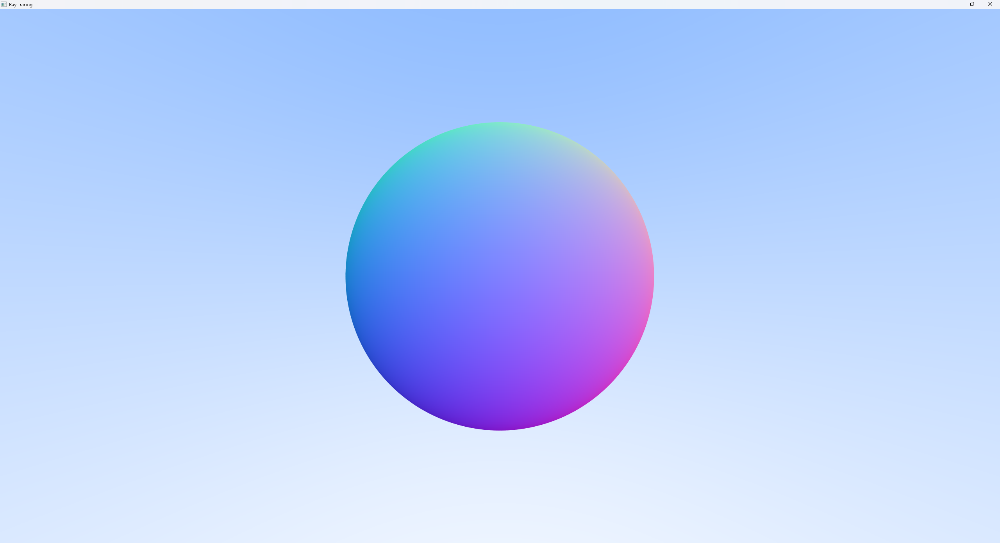

# **计算机图形学期末大作业-小组报告**

**题目：光线追踪图片的渲染实现**

| 姓名   | 学号     |
| ------ | -------- |
| 胡舸耀 | 22336084 |

日期：2024年12月31日

## **一**  **、** **实验概述**

原本开题报告中计划实现光线追踪后，对可动光源实现一个短影片渲染，但是实际情况下因为性能的限制，单张图片的渲染也需要大量的时间，所以将选题修改为光线追踪图片的渲染实现！！！

接下来讲解光线追踪图片的渲染实现的概述：

首先，我们在作业二的基础框架上，将场景0修改为我们需要实现的光线追踪渲染场景，同时修改 `resizeBuffer`函数，使得可以全屏显示。

接下来我们逐步实现光线追踪：
1.完成射线类和简单的摄像机构建，并渲染一个渐变的蓝色天空背景图；
2.为场景添加并渲染一个简单的球形物体并添加地面，同时添加抗锯齿；
3.为场景中的球形物体添加漫反射材质、金属材质和电解质材质，并渲染相应的材质效果图；
4.实现摄像机的聚焦模糊效果；
5.渲染一张接近真实的图片。
6.查看对应渲染所需要时间以及能否性能提升。添加优化。

## **二** **、技术路线与方案**

#### **1. 完成射线类和摄像机构建，渲染蓝色天空背景图**

**射线类** ：实现 `Ray` 类，描述光线的起点和方向。

**摄像机 ：**

* 建立视椎体，根据像素在图像平面上的位置计算射线的方向。
* 支持纵横比调整，形成标准视角。

**天空背景 ：**

* 基于射线方向（`y` 轴角度）插值生成渐变颜色。
* 使用简单的线性插值：白色和蓝色渐变。

#### **2. 添加球形物体和地面，抗锯齿**

**球体渲染** ：

* 使用代数方程计算射线与球体的交点。
* 球体的法线由交点计算，生成平滑表面。

**地面渲染** ：

* 使用一个水平平面（`y=0`）表示地面，判断射线是否交叉。
* 棋盘格模式通过交点坐标进行取模判断。

**抗锯齿** ：

* 使用随机多重采样，每像素发射多个射线并平均颜色。
* 伽马校正处理输出。

#### **3. 为球体添加材质：漫反射、金属、电解质材质**

**材质模型** ：

* **漫反射** ：根据 Lambertian 模型，随机生成射线方向，模拟粗糙表面的反射。
* **金属材质** ：基于镜面反射公式，计算入射光线与法线的反射角度。
* **电解质材质** ：实现 Snell 法则，计算光线折射，同时模拟反射与折射的比例。

#### **4. 实现聚焦模糊效果**

* **技术方案** ：
* 实现景深模拟（Depth of Field）。
* 改造摄像机类，增加光圈大小（`aperture`）和焦距（`focus_distance`）。
* 在光圈内随机采样生成新的射线方向，模拟散焦效果。

#### **5. 渲染接近真实的图片**

**场景设计**：

* 添加多个物体，包括复杂几何和不同材质。
* 渲染出真实的图片。

#### **6. 性能与优化**

**性能测量** ：

* 测量渲染时间。

**优化方向** ：

* **加速结构** ：设计多线程，提高cpu利用率
* **分辨率动态调整** ：根据设备性能动态调整采样率与分辨率。
* **采样优化** ：使用重要性采样和光线分布预测。

**添加交互功能：**

* 为摄像机添加交互功能，无需手动调整代码。

## **三**  **、** **实验过程**

### 1、完成射线类和摄像机构建，渲染蓝色天空背景图

在作业二基础上，保留 `MyGLWidget`类，将多余函数删去，在场景0上构建背景。

首先添加射线类和摄像机类：

```cpp
class Ray {
public:
    vec3 origin;    // 光线起点
    vec3 direction; // 光线方向

    Ray(const vec3& o, const vec3& d) : origin(o), direction(normalize(d)) {}

    vec3 at(float t) const {
        return origin + t * direction; // 参数方程计算点的位置
    }
};


class Camera {
public:
    vec3 origin;            // 摄像机位置
    vec3 lower_left_corner; // 视窗左下角
    vec3 horizontal;        // 视窗水平范围
    vec3 vertical;          // 视窗垂直范围

    Camera(float aspect_ratio = 16.0f / 9.0f, float viewport_height = 2.0f, float focal_length = 1.0f) {
        float viewport_width = aspect_ratio * viewport_height;
        origin = vec3(0.0f, 0.0f, 0.0f);
        horizontal = vec3(viewport_width, 0.0f, 0.0f);
        vertical = vec3(0.0f, viewport_height, 0.0f);
        lower_left_corner = origin - horizontal / 2.0f - vertical / 2.0f - vec3(0.0f, 0.0f, focal_length);
    }

    Ray getRay(float u, float v) const {
        return Ray(origin, lower_left_corner + u * horizontal + v * vertical - origin);
    }
};class
```

然后添加渐变背景渲染，实现函数 `vec3 rayColor(const Ray& r)`

```cpp
vec3 rayColor(const Ray& r) {
	vec3 unit_direction = normalize(r.direction);
	float t = 0.5f * (unit_direction.y + 1.0f); // y 值范围映射到 [0, 1]
	return (1.0f - t) * vec3(1.0f, 1.0f, 1.0f) + t * vec3(0.5f, 0.7f, 1.0f); // 渐变蓝色
}
```

修改场景0如下，基于屏幕的像素点生成光线并渲染背景，同时动态获取当前窗口大小，而不是固定分辨率：

```cpp
void MyGLWidget::scene_0() {
	glClear(GL_COLOR_BUFFER_BIT | GL_DEPTH_BUFFER_BIT);

	int image_width = WindowSizeW;  // 使用当前窗口宽度
	int image_height = WindowSizeH; // 使用当前窗口高度
	float aspect_ratio = float(image_width) / image_height;

	Camera cam(aspect_ratio);

	// 创建颜色缓冲区
	std::vector<vec3> framebuffer(image_width * image_height);

	for (int j = 0; j < image_height; ++j) {
		for (int i = 0; i < image_width; ++i) {
			float u = float(i) / (image_width - 1);
			float v = float(j) / (image_height - 1);
			Ray r = cam.getRay(u, v);
			framebuffer[j * image_width + i] = rayColor(r);
		}
	}

	// 绘制像素到屏幕
	glDrawPixels(image_width, image_height, GL_RGB, GL_FLOAT, framebuffer.data());
	glFlush();
}
```

为了实现可全屏，同样要修改 `resizeGL(int w, int h)`

```cpp
void MyGLWidget::resizeGL(int w, int h) {
    WindowSizeW = w; // 更新窗口宽度
    WindowSizeH = h; // 更新窗口高度
    glViewport(0, 0, w, h); // 设置新的视口大小
    resizeBuffer(w, h); // 调整缓冲区大小
    clearBuffer(render_buffer); // 清空缓冲区
    clearZBuffer(z_buffer);     // 清空深度缓冲区
}
```

我们运行代码，就可以得到一张蓝色背景图：


按下F键或者点击全屏，可以实现全屏渲染。

### 2、添加球形物体和地面，抗锯齿

为场景添加球形物体和地面：实现一个函数来检测射线与球体的交点，并渲染对应的颜色。通过射线与平面（地面）的求交来实现地面增加。

修改 `vec3 rayColor(const Ray& r)`

```cpp
vec3 rayColor(const Ray& r) {
    // 渲染球体
    float t;
    if (hitSphere(vec3(0, 0, -1), 0.5, r, t)) {
        vec3 hit_point = r.at(t);
        vec3 normal = normalize(hit_point - vec3(0, 0, -1)); // 法向量
        return 0.5f * (normal + vec3(1.0f, 1.0f, 1.0f));   // 映射到 [0, 1]
    }

    // 渲染地面
    if (hitGround(r, t)) {
        vec3 hit_point = r.at(t);
        return vec3(0.8f, 0.8f, 0.0f); // 地面颜色（浅黄色）
    }

    // 渲染天空
    vec3 unit_direction = normalize(r.direction);
    t = 0.5f * (unit_direction.y + 1.0f);
    return (1.0f - t) * vec3(1.0f, 1.0f, 1.0f) + t * vec3(0.5f, 0.7f, 1.0f);
}
```


可以看到这时候的小球边缘有锯齿现象，我们实现抗锯齿：

```cpp
void MyGLWidget::scene_0() {
	glClear(GL_COLOR_BUFFER_BIT | GL_DEPTH_BUFFER_BIT);

	int image_width = WindowSizeW;  // 使用当前窗口宽度
	int image_height = WindowSizeH; // 使用当前窗口高度
	float aspect_ratio = float(image_width) / image_height;

	Camera cam(aspect_ratio);

	const int samples_per_pixel = 100; // 每像素采样数（抗锯齿）
	std::vector<vec3> framebuffer(image_width * image_height);

	for (int j = 0; j < image_height; ++j) {
		for (int i = 0; i < image_width; ++i) {
			vec3 pixel_color(0, 0, 0);

			for (int s = 0; s < samples_per_pixel; ++s) {
				float u = (i + random_float()) / (image_width - 1); // 随机偏移
				float v = (j + random_float()) / (image_height - 1);
				Ray r = cam.getRay(u, v);
				pixel_color += rayColor(r); // 累加颜色
			}

			// 平均颜色值
			framebuffer[j * image_width + i] = pixel_color / float(samples_per_pixel);
		}
	}

	// 绘制像素到屏幕
	glDrawPixels(image_width, image_height, GL_RGB, GL_FLOAT, framebuffer.data());
	glFlush();
}
```



可以看到小球变得非常光滑，因为这是水平面上，相机与小球同高度，看不到地面，我们只需要调整相机位置，就可以看到地面（相机升高1.0f）。


这里修改为地面高度为-0.5f（与小球半径相同）：


### 3.为球体添加材质：漫反射、金属、电解质材质

#### 漫反射

为了添加材质，我们首先增加一个材质类型的枚举，我在这里主要想要实现三种材质，漫反射、金属、电解质材料。

```cpp
// 定义材质类型的枚举
enum MaterialType {
	LAMBERTIAN,
	METAL,
	DIELECTRIC,
};

```

为了保存材料信息，我们新建材料类

```cpp
// 材质类
class Material {
public:
	MaterialType type;
	vec3 albedo;       // 漫反射或金属颜色
	float fuzz;        // 金属粗糙度
	float ref_idx;     // 折射率（用于电介质）

	Material(MaterialType t, vec3 color, float f = 0.0f, float ri = 1.0f)
		: type(t), albedo(color), fuzz(f), ref_idx(ri) {}

	bool scatter(const Ray& r_in, const vec3& hit_point, const vec3& normal, vec3& attenuation, Ray& scattered) const;
};
```

在 `bool scatter(const Ray& r_in, const vec3& hit_point, const vec3& normal, vec3& attenuation, Ray& scattered) const;`函数中实现材质的光线计算。

对漫反射而言，根据朗伯余弦定律

* 对于一个理想的漫反射表面，表面上的每一点反射的光强度与入射光线与该点表面法线之间的夹角的余弦成正比。
* 换句话说，光线越是垂直于表面，反射的光强度越大；反之，光线与表面之间的夹角越大，反射的光强度越小。

根据 朗伯余弦定律，光线在漫反射表面上的散射是均匀的，且分布在一个球形区域内。这意味着，入射光线的反射不会沿着入射光线的方向，而是会朝着一个随机方向发散。为了模拟漫反射，我们生成一个随机方向向量，使其分布在单位球体内。接着，我们通过计算 `target - hit_point` 来得到从 `hit_point` 到 `target` 的向量，这就是新的反射光线的方向。它代表了从交点发射的光线的传播方向。在漫反射中，衰减因子通常是材质的颜色或反射率。衰减因子决定了反射光线的强度。在漫反射的情况下，这个衰减因子是材料的颜色（即 `albedo`），它决定了光线反射后的颜色。

根据原理得到相关计算过程：

```cpp
// 漫反射材质
if (type == LAMBERTIAN) {
	vec3 target = hit_point + normal + random_in_unit_sphere(); // 漫反射目标点
	scattered = Ray(hit_point, target - hit_point); // 发射新的反射光线
	attenuation = albedo; // 漫反射衰减为材质颜色
	return true;
}
```


#### 金属材质

1. 镜面反射与金属材质的特性

在金属材质中，反射光线是沿着入射光线反射的镜面反射方向。镜面反射遵循反射定律，即反射光线的方向与入射光线和法线之间的关系满足：

$反射方向=入射方向−2⋅(入射方向⋅法线)⋅法线$

其中，`反射方向` 是光线反射后的方向，`入射方向` 是入射光线的方向，`法线` 是表面上的法线向量。

2. 模糊反射（Fuzzy Reflection）

在实际的金属材质上，表面并不是完美光滑的，而是有一定的粗糙度。这种粗糙度导致反射光线不再完美地沿着入射光线的反射方向传播，而是会有一些散射。通过引入**模糊反射**（`fuzz`），我们模拟了这种粗糙的金属表面。通过在反射光线方向上添加一个随机的扰动，使反射光线变得不完全沿着镜面反射方向传播。`fuzz` 值控制了这种扰动的强度，`fuzz = 0.0` 时表示完美镜面反射，`fuzz > 0.0` 时会使反射光线有一定的散射。

```cpp
// 金属材质的反射
else if (type == METAL) {
	vec3 reflected = reflect(normalize(r_in.direction), normal); // 计算反射光线
	scattered = Ray(hit_point, reflected + fuzz * random_in_unit_sphere()); // 模糊反射
	attenuation = albedo; // 金属材质的衰减通常为其颜色
	return (dot(scattered.direction, normal) > 0); // 确保反射光线与法线方向一致
}
```


#### 电解质

电解质材质是模拟透明材质（如玻璃、水晶等）的反射和折射特性。在计算机图形学中，折射材质的行为通常通过折射和全内反射两种现象来模拟。光线通过材质的界面时会发生折射，而如果角度较大，则会发生全内反射。

折射材质的核心是基于斯涅尔定律来计算光线在介质交界面上的折射方向。而全内反射的概率通过Schlick近似来计算，并在反射光线和折射光线之间进行选择。

首先计算反射光线的方向，使用了反射定律：入射光线与法线的夹角决定了反射光线的方向。

在折射过程中，折射率（`ref_idx`）决定了光线在两种介质之间的传播速度差异。在进入折射介质时，光线会发生偏折。`etai_over_etat` 计算了介质之间的折射率比值。通常：如果光线从空气（折射率为 1.0）进入另一个介质（如玻璃，折射率为 1.5）

使用 `refract()` 函数计算折射光线的方向。如果折射成功，`refract()` 会返回 `true` 并且填充 `refracted` 变量。如果折射失败（例如光线角度过大导致全内反射），则返回反射光线。如果折射成功，则通过Schlick近似来计算反射的概率。`schlick()` 函数会根据 `cos_theta` 和 `ref_idx` 来估算反射概率。这个近似方法通过入射角度（`cos_theta`）来判断光线是折射还是反射的概率。根据 `reflect_prob` 和 `random_float()` 的值，决定是使用反射光线还是折射光线。如果生成的随机数小于 `reflect_prob`，则使用反射光线；否则，使用折射光线。

```cpp
// 电解质材质（折射玻璃球）
else if (type == DIELECTRIC) {
	vec3 reflected = reflect(r_in.direction, normal); // 计算反射光线
	vec3 refracted;
	float reflect_prob;
	attenuation = vec3(1.0f, 1.0f, 1.0f); // 折射材质的衰减为常数

	// 计算折射率
	float etai_over_etat = (r_in.direction.y > 0) ? (1.0f / ref_idx) : ref_idx;

	// 计算光线与法线的夹角cos值
	float cos_theta = dot(r_in.direction, normal);
	cos_theta = fmin(cos_theta, 1.0f); // 限制cos_theta在[-1, 1]区间

	// 尝试折射，如果成功，计算反射的概率
	if (refract(r_in.direction, normal, etai_over_etat, refracted)) {
		reflect_prob = schlick(cos_theta, ref_idx); // 使用Schlick近似计算反射概率
	}
	else {
		scattered = Ray(hit_point + normal * 0.001f, reflected); // 如果折射失败，则使用反射
		return true;
	}

	// 根据反射概率决定使用反射光线还是折射光线
	if (random_float() < reflect_prob) {
		scattered = Ray(hit_point + normal * 0.001f, reflected); // 使用反射光线
	}
	else {
		scattered = Ray(hit_point + normal * 0.001f, refracted); // 使用折射光线
	}
	return true;
}
```


到这里，我们就基本上实现了光线追踪的效果，可以得到很真实的图片了。

### 4、实现离焦模糊效果

为了实现离焦模糊，我们可以在原有的 **`Camera`** 类的基础上增加焦点控制和光圈模拟，而不修改现有的类参数结构。我们只需要在 `getRay` 方法中进行扩展，模拟焦外模糊。

我们需要实现

1. **焦点控制（focus distance）**：确保射线生成的光线能够聚焦在某个特定的焦点平面上，近或远的物体会出现模糊。
2. **光圈（aperture）控制** ：通过增加一个光圈的控制参数，影响生成光线的“散射”程度，从而实现离焦模糊效果。
3. **偏移量** ：通过光圈半径（lens radius）控制光线发散，生成离焦模糊的效果。

通过添加光圈和焦点 ：我们将通过在相机外部创建一个  **`lens_radius`** （光圈半径）和  **`focus_dist`** （焦点距离）来模拟这个效果。这两个参数不会修改原有的类，但会影响射线的生成方式。修改 `getRay` ：光线生成时引入一个随机的光圈散射偏移量，模拟焦点以外的模糊效果。

如下：

```cpp
class Camera {
public:
    vec3 origin;            // 摄像机位置
    vec3 lower_left_corner; // 视窗左下角
    vec3 horizontal;        // 视窗水平范围
    vec3 vertical;          // 视窗垂直范围
    float lens_radius;      // 镜头半径，用于光圈模糊
    float focus_dist;       // 焦距，用于光圈模糊

    // 相机构造函数
    Camera(vec3 position, vec3 look_at, vec3 up, float aspect_ratio, float aperture, float focus_dist) {
        origin = position;
        this->focus_dist = focus_dist;  // 保存焦距
        vec3 w = normalize(position - look_at);
        vec3 u = normalize(cross(up, w));
        vec3 v = cross(w, u);

        // 设定视窗的高度和宽度
        float viewport_height = 2.0f;
        float viewport_width = aspect_ratio * viewport_height;

        // 计算视窗的范围
        horizontal = viewport_width * u;
        vertical = viewport_height * v;

        // 计算视窗的左下角位置
        lower_left_corner = origin - horizontal / 2.0f - vertical / 2.0f - w;

        // 焦点距离调整视窗的位置
        horizontal *= focus_dist;
        vertical *= focus_dist;
        lower_left_corner = origin - horizontal / 2.0f - vertical / 2.0f - w;

        lens_radius = aperture / 2.0f;  // 光圈半径
    }

    // 获取射线，支持光圈模糊
    Ray getRay(float u, float v) const {
        // 随机生成一个光圈上的点偏移
        vec3 rd = lens_radius * random_in_unit_disk();  // 在单位圆盘上随机生成一个点
        vec3 offset = horizontal * rd.x + vertical * rd.y;  // 将偏移量应用到像素位置

        // 计算射线的方向，方向是从相机原点到视窗上的某个点
        vec3 direction = lower_left_corner + u * horizontal + v * vertical - origin - offset;

        // 返回射线对象
        return Ray(origin + offset, direction);
    }
};
```

通过控制焦距以及镜头半径和相机的位置，我们就可以实现离焦模糊。

为了让结果更加清晰，我们修改地面颜色，改为国际象棋棋盘，黑白交错：


可以看到这张图片非常真实（这里为了体现出离焦效果，镜头半径设置较大）。

### 5、渲染接近真实的图片

可以看到，我们基本上可以得到一张炫酷真实的图片，基本上实现了光线追踪，这里我们可以建立一个抽象类 `class Hittable`来保留显示的物体，然后建立一个实例化类 `class Sphere`球类，保存球体数据，并且把物体之间光线碰撞用函数hit实现，如下：

```cpp
class Hittable {
public:
    virtual bool hit(const Ray& r, float t_min, float t_max, float& t, vec3& hit_point, vec3& normal, Material& mat) const = 0;
    virtual ~Hittable() {}
};
class Sphere : public Hittable {
public:
    vec3 center;
    float radius;
    Material material;

    Sphere(vec3 c, float r, Material m) : center(c), radius(r), material(m) {}

    bool hit(const Ray& r, float t_min, float t_max, float& t, vec3& hit_point, vec3& normal, Material& mat) const override {
        // 球体的相交计算逻辑
        vec3 oc = r.origin - center;
        float a = dot(r.direction, r.direction);
        float b = dot(oc, r.direction);
        float c = dot(oc, oc) - radius * radius;
        float discriminant = b * b - a * c;

        if (discriminant > 0) {
            float root = sqrt(discriminant);
            float temp = (-b - root) / a;
            if (temp < t_max && temp > t_min) {
                t = temp;
                hit_point = r.at(t);
                normal = (hit_point - center) / radius;
                mat = material;
                return true;
            }

            temp = (-b + root) / a;
            if (temp < t_max && temp > t_min) {
                t = temp;
                hit_point = r.at(t);
                normal = (hit_point - center) / radius;
                mat = material;
                return true;
            }
        }
        return false;
    }
};
```

利用抽象类可以确保想要生成不同类的物体时可以减少修改，统一格式，例如我们可以生成Cube类等。

同时，当我们增多小球数量时，尤其是电解质类，图片渲染速度大幅度下降，这里我们选择实现多线程运行来充分利用cpu性能，提高渲染速度：

```cpp
// 使用多线程进行渲染
void renderScene(int start, int end, int image_width, int image_height, const Camera& cam,
	const std::vector<Sphere>& world, std::vector<vec3>& framebuffer, int max_depth, int samples_per_pixel) {
	for (int j = start; j < end; ++j) {  // 遍历垂直方向的像素行
		for (int i = 0; i < image_width; ++i) {  // 遍历每行中的每个像素
			vec3 pixel_color(0, 0, 0);
			for (int s = 0; s < samples_per_pixel; ++s) {  // 对每个像素进行多次采样
				float u = (i + random_float()) / (image_width - 1);  // 计算屏幕空间坐标
				float v = (j + random_float()) / (image_height - 1);
				Ray r = cam.getRay(u, v);  // 从相机发射一条光线
				pixel_color += rayColor(r, world, max_depth);  // 计算光线与场景相交后的颜色
			}
			// 每个像素的颜色是所有采样的平均值
			framebuffer[j * image_width + i] = pixel_color / float(samples_per_pixel);
		}
	}
}
```

```cpp
void MyGLWidget::scene_0() {
	glClear(GL_COLOR_BUFFER_BIT | GL_DEPTH_BUFFER_BIT);  // 清除帧缓冲和深度缓冲

	int image_width = WindowSizeW;  // 图像宽度
	int image_height = WindowSizeH;  // 图像高度
	float aspect_ratio = float(image_width) / image_height;  // 计算宽高比


	Camera camera(camera_position, camera_look_at, camera_up, aspect_ratio, aperture, focus_dist);  // 创建相机

	// 创建场景中的物体
	std::vector<Sphere> world = {
		Sphere(vec3(0, 0.5, -1), 0.5f, Material(LAMBERTIAN, vec3(0.7f, 0.3f, 0.3f), 0.3f)),
		Sphere(vec3(1, 0.5, -1), 0.5f, Material(METAL, vec3(0.8f, 0.6f, 0.2f), 0.3f)),
		Sphere(vec3(-1, 0.5, -1), 0.5f, Material(DIELECTRIC, vec3(1.0f), 0.0f, 1.5f)),
		//Sphere(vec3(-1.5, 1, -1), 1.0f, Material(DIELECTRIC, vec3(1.0f), 0.0f, 1.5f)),
	};

	const int samples_per_pixel = 100;  // 每个像素的采样次数
	const int max_depth = 50;  // 最大递归深度
	std::vector<vec3> framebuffer(image_width * image_height);  // 用于存储图像像素的缓冲区

	// 多线程渲染
	int num_threads = std::thread::hardware_concurrency();  // 获取硬件并发线程数
	std::vector<std::thread> threads;
	int rows_per_thread = image_height / num_threads;  // 每个线程处理的行数

	for (int t = 0; t < num_threads; ++t) {
		int start = t * rows_per_thread;
		int end = (t == num_threads - 1) ? image_height : start + rows_per_thread;
		threads.emplace_back(renderScene, start, end, image_width, image_height, camera, std::cref(world), std::ref(framebuffer), max_depth, samples_per_pixel);
	}

	for (auto& thread : threads) {
		thread.join();  // 等待所有线程完成渲染
	}

	// 绘制像素到屏幕
	glDrawPixels(image_width, image_height, GL_RGB, GL_FLOAT, framebuffer.data());
	glFlush();  // 刷新显示
}
```

在场景0中，我们先获取硬件并发线程数，将处理行数平均分配给每个线程，调用线程运行渲染，可以大幅度提高渲染速度。

这里我的设备是AMD R5-7500F，具体频段如下，窗口为800, 450时可以一秒钟渲染一次，全屏2k（2560*1440）时大概五到十秒渲染一次（三个球体时）。


我们只需要调整world中小球数据即可实现不同小球的渲染。

这里我给出一张我随意添加小球后的渲染图片：


我们这张图片非常真实，这就说明我们实现了光线追踪！！！可以看到只要给出对应的模型我们就可以很好的实现光线追踪！！！

### 6、性能与优化

其实性能优化方面我们在前面已经说明了，我们增加了简洁的计算方式以及添加了多线程方法进行性能优化。

这里我们主要讲解交互优化。

我们发现一开始的摄像机位置、光圈等都需要多次调整才能得到一个比较好的位置，所以我们在这里添加交互设计，设计wasd为向前左后右移动摄像机，qe分别为上移摄像机与下移摄像机。通过上下左右键分别对焦距距离以及模糊程度（光圈大小）进行调整。

```cpp
void MyGLWidget::keyPressEvent(QKeyEvent* e) {
	float step_size = 0.5f;
	switch (e->key()) {
	case Qt::Key_0:
		scene_id = 0;
		update();
		break;
	case Qt::Key_F:
		if (isFullScreen()) {
			showNormal(); // 切换回普通窗口
		}
		else {
			showFullScreen(); // 切换到全屏
		}
		break;
	case Qt::Key_W:
		camera_position += vec3(0, 0, -step_size); // 向前
		update();
		break;
	case Qt::Key_S:
		camera_position += vec3(0, 0, step_size);  // 向后
		update();
		break;
	case Qt::Key_A:
		camera_position += vec3(-step_size, 0, 0); // 向左
		update();
		break;
	case Qt::Key_D:
		camera_position += vec3(step_size, 0, 0);  // 向右
		update();
		break;
	case Qt::Key_Q:
		camera_position += vec3(0, step_size, 0);  // 向上
		update();
		break;
	case Qt::Key_E:
		camera_position += vec3(0, -step_size, 0); // 向下
		update();
		break;
	case Qt::Key_Up:
		focus_dist += 0.5f; // 焦距增大
		update();
		break;
	case Qt::Key_Down:
		focus_dist -= 0.5f; // 焦距减少
		update();
		break;
	case Qt::Key_Right:
		aperture += 0.002f; // 模糊程度增加
		update();
		break;
	case Qt::Key_Left:
		aperture -= 0.002f; // 模糊程度减少
		update();
		break;
	default:
		QWidget::keyPressEvent(e); // 调用默认键盘处理
	}


}
```

到这里我们就实现了全部的光线追踪图片渲染。

## 四、实验总结

在本次实验中，我们成功实现了基于光线追踪（Ray Tracing）算法的图像渲染，并对其进行了优化，加入了多线程处理和交互系统，从而提高了渲染效率和可操作性。光线追踪算法通过模拟光与物体的相互作用，生成图像。每个像素的光线从摄像机出发，经过视图平面，根据材质的不同对光线进行反射、折射或传播计算，最终得到该像素的颜色值。

在材质模型方面，我们实现了三种主要的材质类型：漫反射材质、金属材质和电解质材质。漫反射材质模拟了物体表面的光散射，光线的反射方向是随机的，适用于模拟不平滑表面。金属材质模拟了金属表面的镜面反射，光线反射的方向受到入射光线的影响，并加入了模糊效果，以表现金属表面微小的不规则性。电解质材质则模拟了透明物体如玻璃的折射和反射特性，通过斯涅尔定律计算折射光线，并使用 Schlick 近似来估算反射概率，从而得到真实的透明材质效果。

为了增强渲染的真实感，我们还实现了光圈模糊（Bokeh）和景深效果。通过控制摄像机的光圈大小和焦点距离，我们模拟了相机镜头的景深效果，使得图像中的近焦点和远焦点区域产生模糊，而焦点区域则保持清晰，这种模拟效果大大提升了图像的自然感和立体感。

为了加快渲染速度并应对复杂场景的渲染需求，我们引入了多线程处理。在渲染过程中，场景的每一行像素由独立的线程处理，从而有效利用多核 CPU 的计算能力，提高了渲染效率。同时，交互系统也使得用户能够实时控制视角、材质等参数，进一步增强了实验的灵活性和用户体验。

通过这一系列优化和功能实现，我们成功地将光线追踪算法应用于图像渲染，并实现了高效且富有交互性的渲染系统。
